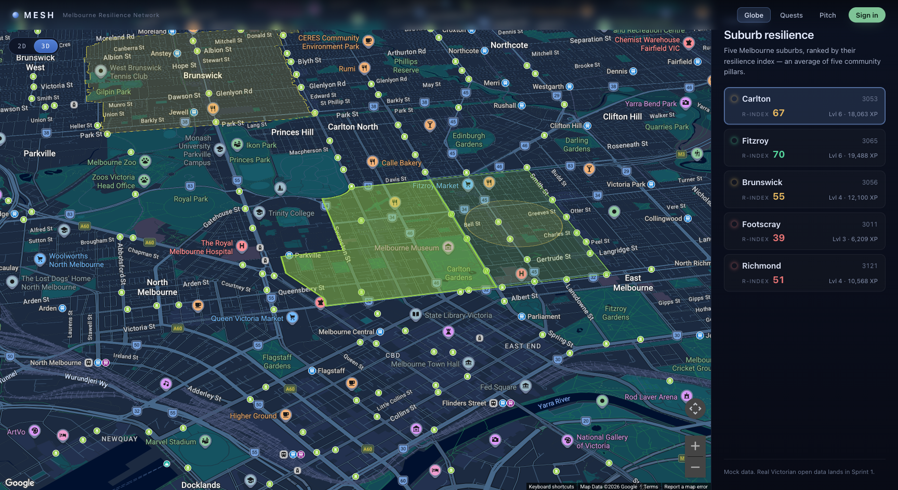

# MESH — Melbourne Exchange & Solidarity Hub

> A gamified civic platform where Melbourne residents discover local resources, complete community quests, and collectively build suburb-level resilience — powered by Victorian open data and AI agents.
>
> The name reads as the visualisation itself: a **mesh** of suburbs, an **exchange** of skills and tools, and the **solidarity** that turns a network into a community.

**🌐 Live demo →** [mesh-pi-topaz.vercel.app](https://mesh-pi-topaz.vercel.app/)



## What it is

Melbourne is a network of **suburbs**, each carrying a **resilience index** (R-index) derived from five pillars — food security, skill density, resource sharing, social connectivity, and emergency preparedness. MESH renders that network on a real 2.5D map of inner Melbourne (with optional 3D building extrusion), lets residents pick their suburb, and runs **six AI agents** that read the data and respond:

| Agent | Role | Status |
|---|---|---|
| **Quest Generator** | Reads suburb data → proposes one concrete, achievable community initiative targeting the weakest pillar | ✅ wired end-to-end |
| **Initiative Advisor** | Streaming chat — grounded in the selected suburb's context | ✅ wired end-to-end |
| **Suburb Narrator** | Weekly plain-English suburb digest | ✅ wired end-to-end |
| Submission Verifier | Reviews quest evidence (text + photo), awards XP | design only |
| Resource Matchmaker | Pairs "offer" + "need" posts across suburbs | design only |
| Anomaly Watcher | Watches open-data diffs, spawns reactive quests/alerts | design only |

Full agent specs in [AGENTS.md](AGENTS.md).

## What's visible today

The frontend, three AI agents, real open-data-derived suburb scores, a demo auth + profile flow, a long-form pitch page, and five inner-Melbourne suburbs rendered on a real Google Maps basemap are live. Supabase migrations are written and the typed client is wired offline; provisioning + DB-backed reads land next.

**At `/`** — the map. Real Melbourne basemap with five suburb polygons (OSM boundaries) colour-coded by R-index. Sidebar selection or a polygon click flies the camera in, tilts to 2.5D, and reveals 3D building extrusion in the CBD via Google Maps' WebGL vector renderer. A top-left **2D / 3D toggle** lets viewers flatten the view; preference persists in localStorage. The top-r_index suburb has a permanent pulsing golden ring; every selection fires a screen-projected burst animation. The detail card shows pillar scores plus a live **advisor chat** that streams Claude responses contextualised to that suburb. A small **(i) provenance icon** next to the suburb name expands a panel showing where that suburb's data actually came from — real / partial / SEIFA-approximated — with links to each underlying dataset.

**At `/quests`** — the quest board. Five hand-curated seed quests (one per suburb, marked **EXAMPLE**, each targeting its weakest pillar) load on first paint. Per-suburb **"Regenerate with Claude →"** buttons replace the seed with a fresh AI-generated quest (marked **AI**); the generated ones persist to localStorage so they survive a refresh. Quests generated from the advisor chat appear here too — the two surfaces share state. Every AI card shows a **SIGNAL strip** explaining in one sentence which pillar Claude targeted and the data point that drove the choice (e.g. *"Carlton scored 27/100 — the lowest of its five pillars"*); the **"How this was created"** expander lists the model, generation timestamp, the full inputs Claude saw, and links to the underlying datasets.

**At `/pitch`** — the long-form pitch. Editorial scroll-paced narrative covering vision → pillars → loop → agents → game layer → honest data provenance → stack → roadmap. Section 07 lists each suburb's data sources with links; section 09 tracks sprint state. Real screenshots from the prototype embedded as field reports.

**At `/login` + `/app/profile`** — demo auth. Pick a preset persona (Maya/Carlton, Tom/Brunswick, Sofia/Footscray, **Admin · Demo**) or "play yourself" with a custom name + suburb. Profile shows level + XP bar + badges grid + recent activity + an inline-edit settings strip. Session persists in localStorage; the magic-link form is rendered but disabled until Supabase is provisioned.

**At `/admin`** — operator surface, gated on `profile.is_admin === true`. Three counters (Examples / AI generated / Empty), a one-click **"Generate all 5 with Claude →"** button that fires the agent in parallel, and **"Reset all to example"** for repeat demos. Sign in as **Admin · Demo** to reach it.

## Stack

| Layer | Tech |
|---|---|
| Frontend | SvelteKit 2 + Svelte 5 (runes mode) + TypeScript |
| Map | Google Maps Platform — WebGL vector renderer with Map ID, tilt + 3D buildings |
| AI Agents | Anthropic Claude (`claude-sonnet-4-20250514`) — streaming SSE + JSON modes |
| Hosting | Vercel — auto-deploy on `main` |
| Database | Supabase PostgreSQL + PostGIS — migrations + typed client offline; DB not yet provisioned |
| Edge Functions | Supabase / Deno (planned, Sprint 6+) |
| Open data | data.melbourne.vic.gov.au (OpenDataSoft v2.1, anonymous) — seed-driven; live sync planned |
| Suburb boundaries | OpenStreetMap via Nominatim (one-time fetch into `src/lib/data/suburb-geometries.json`) |

## Quick start

```bash
pnpm install
cp .env.example .env.local        # see below for which keys you need
pnpm dev                          # http://localhost:5173
```

### Required env vars

| Var | Required for | How to get it |
|---|---|---|
| `ANTHROPIC_API_KEY` | All AI surfaces (advisor chat, quest generator, narrator) | [console.anthropic.com](https://console.anthropic.com) → API Keys |
| `PUBLIC_GOOGLE_MAPS_API_KEY` | Home page map | [console.cloud.google.com](https://console.cloud.google.com) → enable Maps JavaScript API → Credentials → API key. Restrict to your domains. |
| `PUBLIC_GOOGLE_MAPS_MAP_ID` | Map ID with **Tilt + Rotation** enabled — required for the 2.5D vector renderer + 3D buildings | Google Maps Platform → Map Management → Create Map ID (type: JavaScript) |

Without the Google Maps keys, `/` renders a setup card with the same instructions inline. The Supabase + Victorian-open-data keys in `.env.example` are placeholders until those sprints land.

### Deploy to Vercel

The repo ships with `@sveltejs/adapter-vercel`. To deploy:

1. Open [vercel.com/new](https://vercel.com/new) and **Import** the `furic/mesh` repo.
2. Framework is auto-detected as **SvelteKit**; build command is `pnpm build`, output dir is `.svelte-kit/output`.
3. Under **Environment Variables**, add `ANTHROPIC_API_KEY`, `PUBLIC_GOOGLE_MAPS_API_KEY`, and `PUBLIC_GOOGLE_MAPS_MAP_ID`.
4. Click **Deploy**.

After the first deploy, every push to `main` deploys automatically. Preview deploys are generated for every branch/PR.

```bash
pnpm check                        # svelte-kit sync + svelte-check (typecheck)
pnpm build                        # production build
pnpm preview                      # serve the built app
```

## Project layout

```
src/
├── hooks.server.ts    # per-request typed SupabaseClient (with stub fallback)
├── lib/
│   ├── agents/        # callClaude wrapper + agent design stubs
│   ├── components/
│   │   ├── map/       # MeshMap.svelte — Google Maps 2.5D + polygons + pulse + burst
│   │   ├── suburb/    # SuburbList, AdvisorChat, SuburbDigest
│   │   ├── quest/     # QuestCard
│   │   └── ui/        # Avatar, XPBar, Badge, SuburbPicker
│   ├── data/          # mock-suburbs (real-data-seeded), seeded-quests, personas,
│   │                  # badges, suburb-geometries (OSM boundary GeoJSON)
│   ├── stores/        # user / suburb / quests Svelte 5 runes stores
│   ├── types/         # Suburb domain types + hand-typed Supabase Database
│   └── utils/         # vic-data, melb-data, xp math
├── routes/
│   ├── +page.svelte           # / — map + sidebar + suburb detail + advisor chat
│   ├── quests/                # /quests — AI quest board
│   ├── pitch/                 # /pitch — long-form editorial pitch page
│   ├── login/                 # /login — demo persona picker + magic-link shell
│   ├── app/profile/           # /app/profile — XP, badges, activity, settings
│   └── api/
│       ├── agents/advisor/    # POST → streams Claude SSE
│       ├── agents/narrator/   # POST → suburb digest
│       └── quests/            # POST → returns one JSON quest

scripts/                       # seed-suburbs, fetch-suburb-geo (one-time data pulls)
supabase/migrations/           # 13 SQL files: extensions, suburbs, profiles, quests,
                               # participants, submissions, resources, matches,
                               # narratives, snapshots, xp_ledger, views
supabase/functions/            # Deno edge-function stubs (not yet running)
```

## Docs

- [ARCHITECTURE.md](ARCHITECTURE.md) — system overview + key data flows
- [AGENTS.md](AGENTS.md) — full spec for each of the six AI agents (prompts, types, cost guards)
- [SCHEMA.md](SCHEMA.md) — Supabase tables, RLS, PostGIS extensions (planned)
- [SPRINT_PLAN.md](SPRINT_PLAN.md) — 10-sprint roadmap with checkboxes for what's shipped
- [CLAUDE.md](CLAUDE.md) — guidance for Claude Code working in this repo

## Status & roadmap

Use [SPRINT_PLAN.md](SPRINT_PLAN.md) for the authoritative checklist. Headline progress:

- Sprint 0 — scaffold, env, Vercel auto-deploy: **done**
- Sprint 1 — Victorian open-data pipeline: **done (within current infra)**; `pnpm seed:suburbs` hydrates `mock-suburbs.ts` from real Melbourne open data with honest provenance per suburb
- Sprint 2 — Supabase schema + RLS: **done offline**; 13 migrations + hand-typed `Database` generic for `SupabaseClient<Database>` + `hooks.server.ts` with typed-Proxy fallback. Awaits one user action (provisioning the Supabase project) to go live.
- Sprint 3 — Map: **2.5D map live** (Google Maps WebGL vector renderer with tilt + 3D buildings, real OSM suburb polygons, 2D/3D toggle, top-suburb pulse, selection burst, per-suburb provenance (i) icon). Particle flow + XP-burst on level-up still pending.
- Sprint 4 — Auth & profile: **demo mode live** (persona picker including an Admin role → /app/profile with XP, badges, activity; /admin route gated on `profile.is_admin`). Real magic-link auth gated on Supabase provisioning.
- Sprint 5 — Quest board UI: **partial** (board + cards live, seed quests + persistence + EXAMPLE/AI source chips done; submission form pending in Sprint 7)
- Sprint 6 — Quest Generator agent: **mostly done** — endpoint live, returns full data_snapshot + model + timestamp, surfaces "AI signal" + "How this was created" panel on every card. Edge-function deployment + DB upsert pending.
- Sprint 7 — Submission Verifier: pending
- Sprint 8 — Resource Matchmaker + Exchange UI: pending
- Sprint 9 — Narrator + Advisor: **partial** (both agents live; weekly cron + dedicated suburb route pending)
- Sprint 10 — Polish + Anomaly Watcher + onboarding: pending
