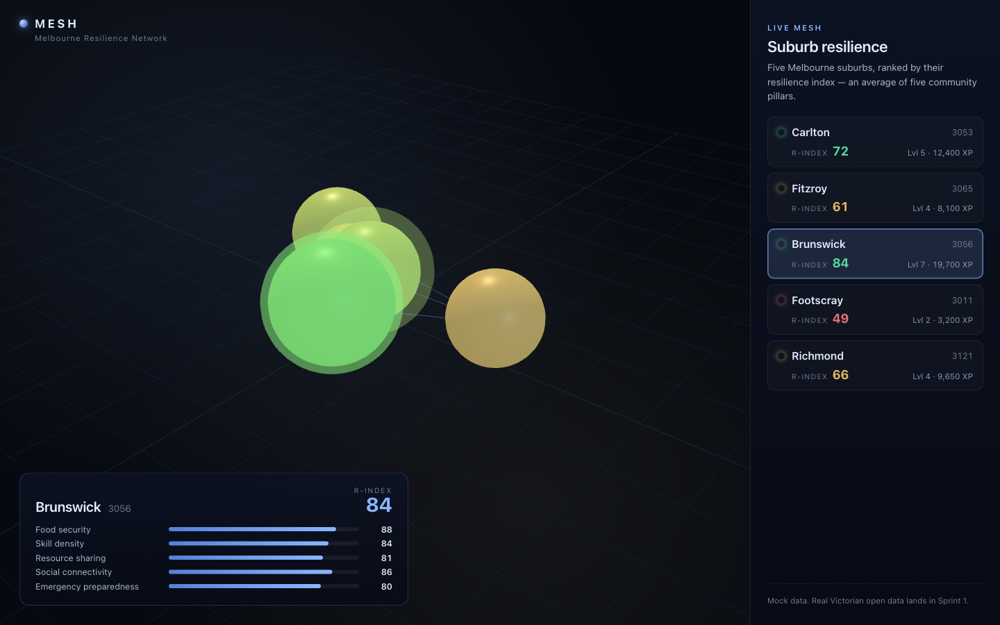
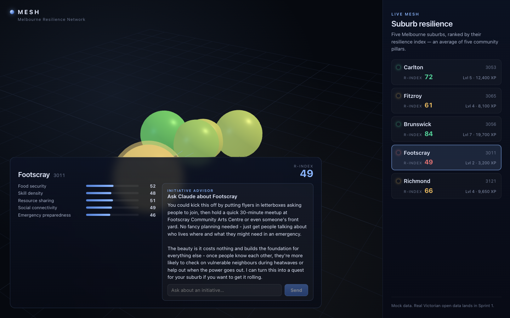
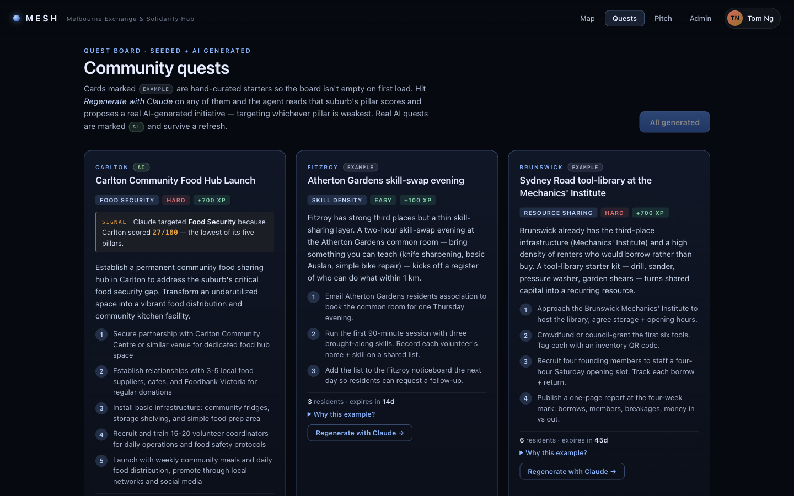

# MESH — Melbourne Exchange & Solidarity Hub

> A gamified civic platform where Melbourne residents discover local resources, complete community quests, and collectively build suburb-level resilience — powered by Victorian open data and AI agents.
>
> The name reads as the visualisation itself: a **mesh** of suburbs, an **exchange** of skills and tools, and the **solidarity** that turns a network into a community.

**🌐 Live demo →** [mesh-pi-topaz.vercel.app](https://mesh-pi-topaz.vercel.app/)



## What it is

Melbourne is a network of **suburbs**, each carrying a **resilience index** (R-index) derived from five pillars — food security, skill density, resource sharing, social connectivity, and emergency preparedness. MESH visualises that network as a living 3D mesh, lets residents pick their suburb, and runs **six AI agents** that read the data and respond:

| Agent | Role | Status |
|---|---|---|
| **Quest Generator** | Reads suburb data → proposes one concrete, achievable community initiative targeting the weakest pillar | ✅ wired end-to-end |
| **Initiative Advisor** | Streaming chat — grounded in the selected suburb's context | ✅ wired end-to-end |
| Submission Verifier | Reviews quest evidence (text + photo), awards XP | design only |
| Resource Matchmaker | Pairs "offer" + "need" posts across suburbs | design only |
| Suburb Narrator | Weekly plain-English suburb digest | design only |
| Anomaly Watcher | Watches open-data diffs, spawns reactive quests/alerts | design only |

Full agent specs in [AGENTS.md](AGENTS.md).

## What's visible today

This repo is partway through Sprint 0 of the [10-sprint plan](SPRINT_PLAN.md). The frontend, two AI agents, and a mock dataset of five inner-Melbourne suburbs are live; Supabase and the Victorian open-data pipeline are not yet wired.

**At `/`** — the globe. Five suburbs projected by lat/lng, coloured by R-index, with click/hover synced to a sidebar. Selecting one opens a detail card with pillar scores plus a live **advisor chat** that streams Claude responses contextualised to that suburb.



**At `/quests`** — the quest board. Per-suburb "Generate quest" buttons call Claude, which reads the suburb's pillar scores and returns a structured JSON quest (title, pillar, difficulty, steps, XP). Quests generated from the advisor chat appear here too — the two surfaces share state.



## Stack

| Layer | Tech |
|---|---|
| Frontend | SvelteKit 2 + Svelte 5 (runes mode) + TypeScript |
| 3D Scene | Three.js (`r184`) |
| AI Agents | Anthropic Claude (`claude-sonnet-4-20250514`) — streaming SSE + JSON modes |
| Hosting | Vercel (planned) |
| Database | Supabase PostgreSQL + PostGIS (planned, Sprint 2) |
| Edge Functions | Supabase / Deno (planned, Sprint 6+) |
| Open data | data.vic.gov.au (CKAN) + data.melbourne.vic.gov.au (OpenDataSoft) — planned, Sprint 1 |

## Quick start

```bash
pnpm install
cp .env.example .env.local        # paste your ANTHROPIC_API_KEY in
pnpm dev                          # http://localhost:5173
```

### Deploy to Vercel

The repo ships with `@sveltejs/adapter-vercel`. To deploy:

1. Open [vercel.com/new](https://vercel.com/new) and **Import** the `furic/mesh` repo.
2. Framework is auto-detected as **SvelteKit**; build command is `pnpm build`, output dir is `.svelte-kit/output`.
3. Under **Environment Variables**, add `ANTHROPIC_API_KEY` with your Anthropic key — required for all three AI surfaces.
4. Click **Deploy**.

After the first deploy, every push to `main` deploys automatically. Preview deploys are generated for every branch/PR.

Only `ANTHROPIC_API_KEY` is needed for the live AI surfaces today. The Supabase and Victorian-open-data keys are placeholders until Sprints 1–2 land.

```bash
pnpm check                        # svelte-kit sync + svelte-check (typecheck)
pnpm build                        # production build
pnpm preview                      # serve the built app
```

## Project layout

```
src/
├── lib/
│   ├── agents/        # callClaude wrapper + 5 design-spec stubs (design docs, not yet imported)
│   ├── components/    # MeshGlobe (Three.js), SuburbList, AdvisorChat, QuestCard
│   ├── data/          # MOCK_SUBURBS — five Melbourne suburbs
│   ├── stores/        # quests.svelte.ts — shared reactive store between chat + board
│   └── types/         # Suburb, QuestPillar, GeneratedQuest
└── routes/
    ├── +page.svelte   # / — globe + sidebar + suburb detail
    ├── quests/        # /quests — AI quest board
    └── api/
        ├── agents/advisor/ # POST → streams Claude SSE through to the browser
        └── quests/         # POST → returns one JSON quest

supabase/functions/      # Deno edge-function stubs (not yet running)
```

## Docs

- [ARCHITECTURE.md](ARCHITECTURE.md) — system overview + key data flows
- [AGENTS.md](AGENTS.md) — full spec for each of the six AI agents (prompts, types, cost guards)
- [SCHEMA.md](SCHEMA.md) — Supabase tables, RLS, PostGIS extensions (planned)
- [SPRINT_PLAN.md](SPRINT_PLAN.md) — 10-sprint roadmap with checkboxes for what's shipped
- [CLAUDE.md](CLAUDE.md) — guidance for Claude Code working in this repo

## Status & roadmap

Use [SPRINT_PLAN.md](SPRINT_PLAN.md) for the authoritative checklist. Headline progress:

- Sprint 0 — scaffold, env, repo: **in progress** (no Vercel yet)
- Sprint 1 — Victorian open-data pipeline: pending
- Sprint 2 — Supabase schema + RLS: pending
- Sprint 3 — Three.js globe: **partial** (camera/orbit + nodes done; particle edges, GSAP fly-in, day/night cycle pending)
- Sprint 5 — quest board UI: **partial** (board + cards live; filtering / join-quest pending)
- Sprint 6 — Quest Generator agent: **partial** (endpoint live; dedup + DB upsert + admin UI pending)
- Sprint 9 — Initiative Advisor: **partial** (streaming chat live; suburb-narrator pending)
